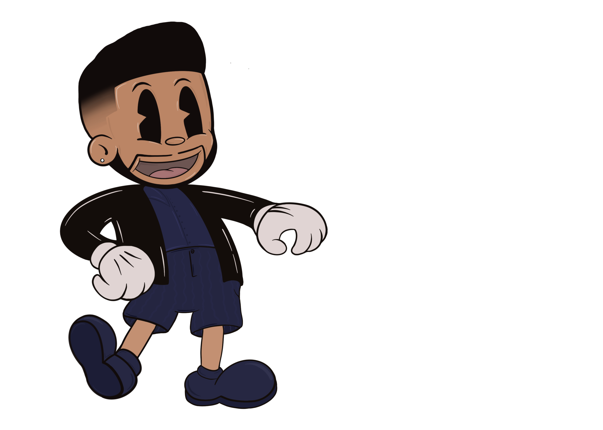
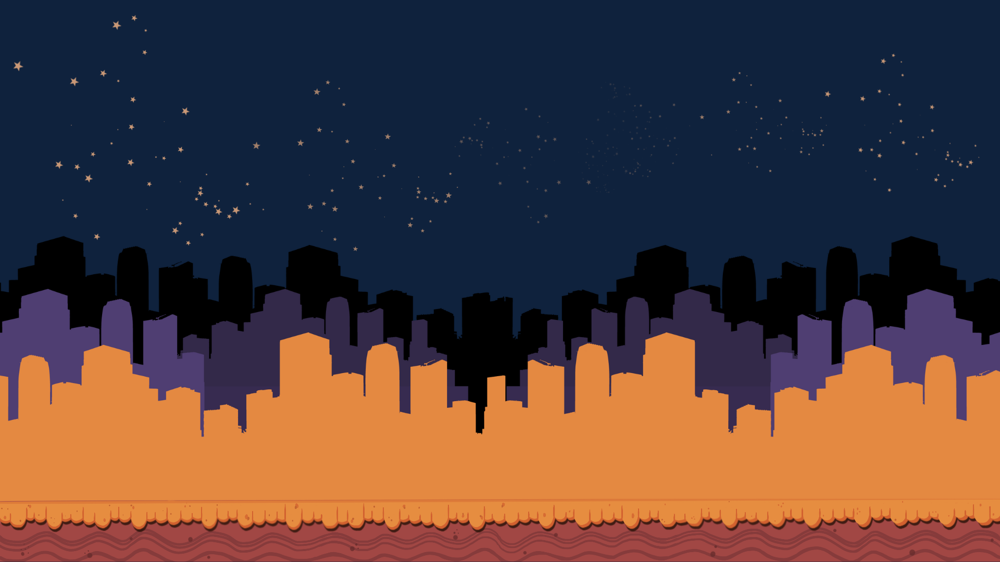
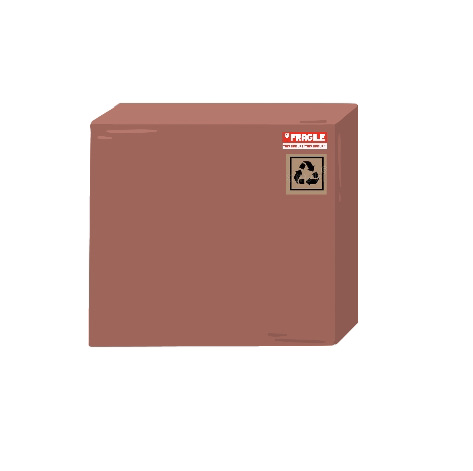
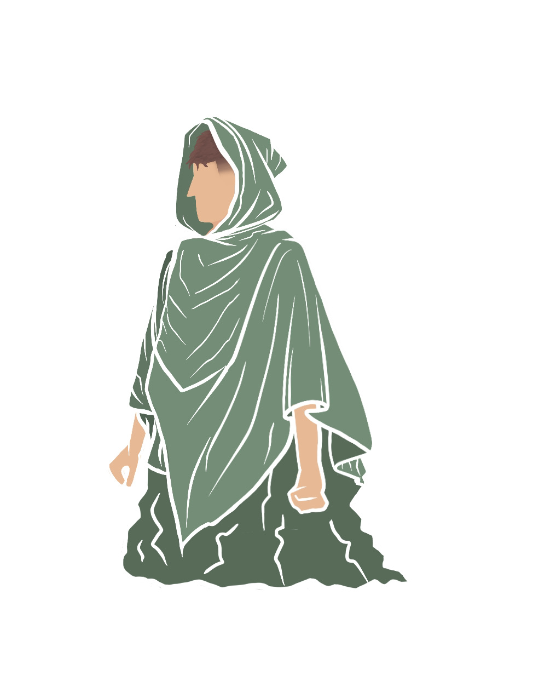
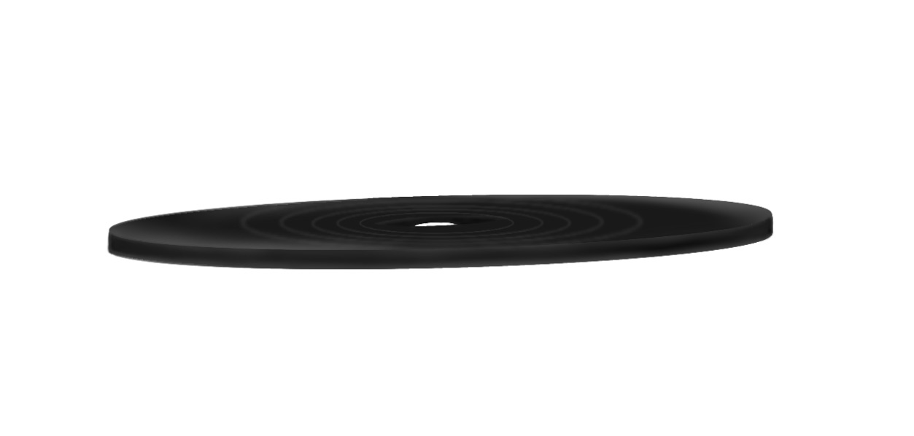

# Lesson: Digital & Serious Games

### First and Last Name: :id: Maria-Nikoletta Katsarou 
### University Registration Number: dpsd19051
### GitHub Personal Profile: [MaritettaKatsarou](https://github.com/MaritettaKatsarou)
### Digital & Serious Games Personal Repository: [Maritetta's Game](https://maritettakatsarou.github.io/Role-Playing-Game/)

# :headphones: Introduction :microphone:
### Στοχος μου: Η δημιουργία ενός παιχνιδιού χωρίς "κακούς" και "σκοτωμούς". Επέλεξα να ασχοληθώ με τα παιχνίδια που χρησιμοποιούν τη μουσική σαν μέρος του gameplay και οχι απλά σαν gaming soundtrack. Ο χρήστης έχει σαν σκοπό να διαλέξει τη σωστή συνέχεια του τραγουδιού (Lyrics) για να προχωρήσει παρακάτω και να κερδίσει φήμη (Fame). Αν δεν τα καταφέρει, μετά απο 3 λανθασμένες επιλογές στίχων, χάνει και η φήμη του πέφτει (πχ στο 0 αν είναι στη 1η πίστα). Για να ξεκλειδώσει τα επόμενα levels πρέπει να έχει ενα συγκεκριμένο fame rate. Ο μόνος του αντίπαλος είναι οι μουσικές του γνώσεις και ο χρόνος καθώς για την επιλογή των lyrics θα εχει 10secs κάθε φορά. 

# ~~Summary~~ Notes:
### Το παιχνίδι φτιάχτηκε στο [Unity](https://unity.com) και χρησιμοποιήθηκε το [Atom](https://atom.io) για την σύνταξη του κώδικα.

# :speaker: 1st Deliverable
### :pushpin: 1st step: Ξεκίνησα με την δημιουργία του χαρακτήρα του παιχνιδιού ο οποίος είναι εμπνευσμένος απο τον τραγουδιστή TheWeeknd.

### :pushpin: 2nd step: Έφτιαξα το background (την πόλη) και το ground το οποίο χρησιμοποιήθηκε και σαν platform στο παιχνιδι γενικά.

### :pushpin: 3rd step: Ακολούθησα τις οδηγίες απο το e-class στην σύνταξη του κώδικα για την κίνηση του χαρακτήρα.

# :speaker: 2nd Deliverable
### :pushpin: 1st step: Αρχικά πρόσθεσα το gameplay music (δεν ήταν στα ζητούμενα του deliverable αλλά είναι απαραίτητο για το παιχνίδι μου)
[How to Add Music To Your Scene](https://www.youtube.com/watch?v=KOf3P5y19Bw)

### :pushpin: 2nd step: Στη συνέχεια δημιούργησα το amination του χαρακτήρα και τα extra αντικείμενα. 
Το Χ που αποτελεί τα collectives του παιχνιδιού:

Tο κουτι που ειναι για να βοηθαει τον χρηστη να φτασει να πιασει τα αντικειμενα: 

Tι θα "πεταει" ο χαρακτήρας στους εχθρούς: 

και τελος τον εχθρο τον ιδιο:

και το τι θα εκτοξεύει σαν αντεπίθεση 

(τον δισκο που φαινεται στην αρχη του παιχνιδιου). Δυστυχως αντιμετωπισα θεμα με το να το κανω να το πεταει ο εχθρος οπότε σκεφτηκα να το αφήσω σαν αντικειμενο με το animation του μαζι για να φανει οτι εχει σχεδιαστεί.

# :speaker: 3rd Deliverable 

# :speaker: Conclusions

# :speaker: Sources
