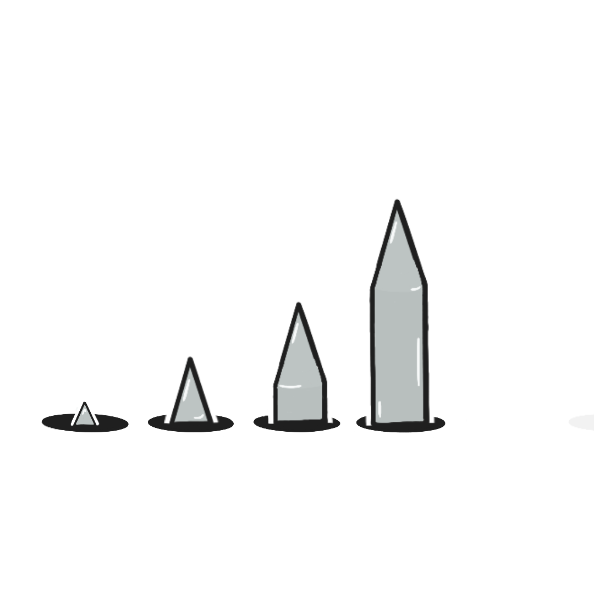
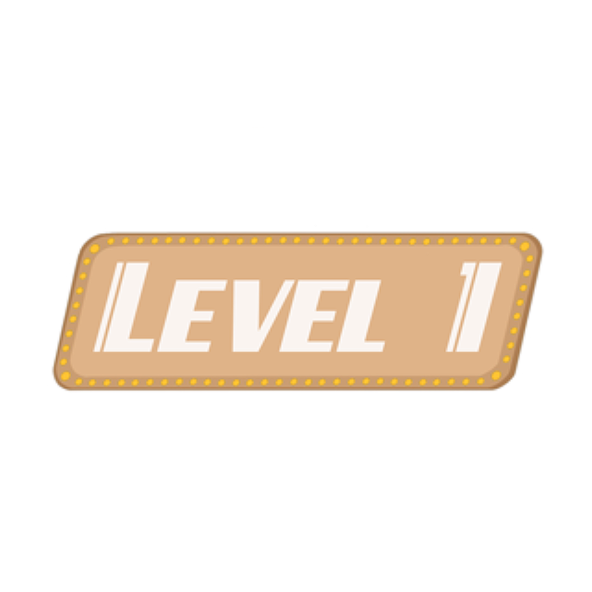
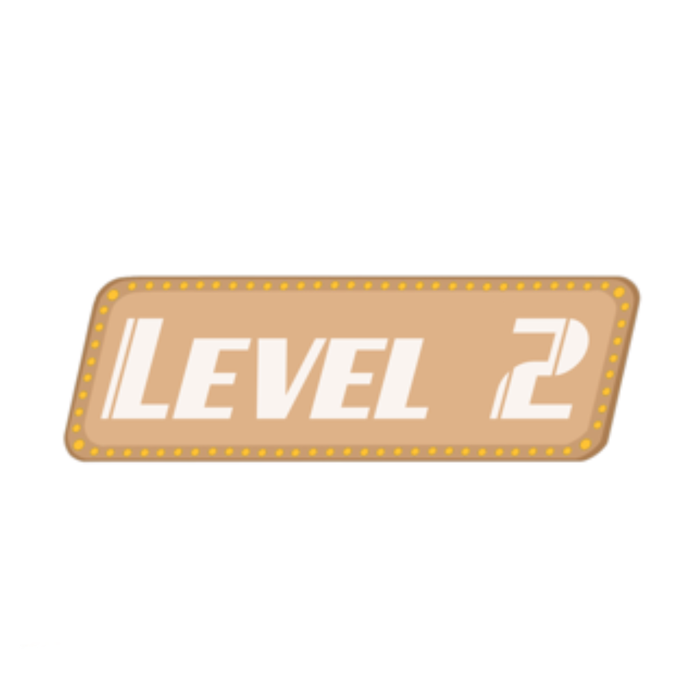
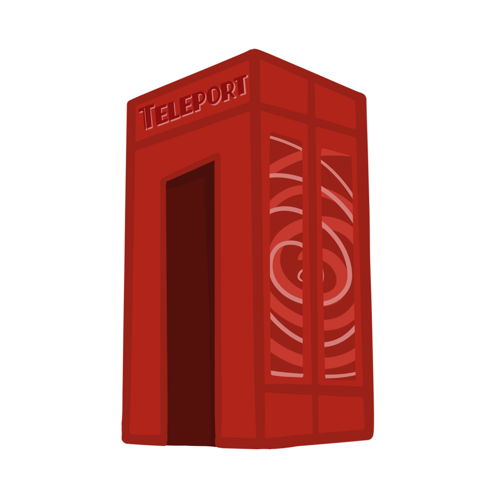

# Lesson: Digital & Serious Games

### First and Last Name: :id: Maria-Nikoletta Katsarou 
### University Registration Number: dpsd19051
### GitHub Personal Profile: [MaritettaKatsarou](https://github.com/MaritettaKatsarou)
### Digital & Serious Games Personal Repository: [Maritetta's Game](https://maritettakatsarou.github.io/Role-Playing-Game/)

# :headphones: Introduction :microphone:
### Στοχος: Στο παιχνίδι αυτο ο χρήστης συλλέγει όσα X του ζητάει καθε level και τα κανει deliver στο τελος της πιστας, αποφεύγοντας τα εμπόδια και τους haters.  
### *Note: How to play instructions at the end of the report.*

~~Η δημιουργία ενός παιχνιδιού χωρίς "κακούς" και "σκοτωμούς". Επέλεξα να ασχοληθώ με τα παιχνίδια που χρησιμοποιούν τη μουσική σαν μέρος του gameplay και οχι απλά σαν gaming soundtrack. Ο χρήστης έχει σαν σκοπό να διαλέξει τη σωστή συνέχεια του τραγουδιού (Lyrics) για να προχωρήσει παρακάτω και να κερδίσει φήμη (Fame). Αν δεν τα καταφέρει, μετά απο 3 λανθασμένες επιλογές στίχων, χάνει και η φήμη του πέφτει (πχ στο 0 αν είναι στη 1η πίστα). Για να ξεκλειδώσει τα επόμενα levels πρέπει να έχει ενα συγκεκριμένο fame rate. Ο μόνος του αντίπαλος είναι οι μουσικές του γνώσεις και ο χρόνος καθώς για την επιλογή των lyrics θα εχει 10secs κάθε φορά.~~ Note: Ο στόχος με βάση τα παραδοτέα του 2ου deliverable άλλαξε.

# ~~Summary~~ General Notes:
### Το παιχνίδι φτιάχτηκε στο [Unity](https://unity.com) και χρησιμοποιήθηκε το [Atom](https://atom.io) για την σύνταξη του κώδικα.

# :speaker: 1st Deliverable
### :pushpin: 1st step: Ξεκίνησα με την δημιουργία του χαρακτήρα του παιχνιδιού ο οποίος είναι εμπνευσμένος απο τον τραγουδιστή TheWeeknd.

### :pushpin: 2nd step: Έφτιαξα το background (την πόλη) και το ground το οποίο χρησιμοποιήθηκε και σαν platform στο παιχνιδι γενικά.

### :pushpin: 3rd step: Ακολούθησα τις οδηγίες απο το e-class στην σύνταξη του κώδικα για την κίνηση του χαρακτήρα.

# :speaker: 2nd Deliverable
### :pushpin: 1st step: Αρχικά πρόσθεσα το gameplay music (απαραιτητο για το 3ο deliverable)
[How to Add Music To Your Scene](https://www.youtube.com/watch?v=KOf3P5y19Bw)

### :pushpin: 2nd step: Στη συνέχεια δημιούργησα το amination του χαρακτήρα και τα extra αντικείμενα. 
Το Χ που αποτελεί τo collectable του παιχνιδιού:

#### Στα collectables εβαλα και ενα counter με τη βοήθεια του [2D Collecting Coins Tutorial](https://www.youtube.com/watch?v=DZ-3g31jk90) για να μετράει το score (απαραιτητο για το 3ο deliverable)

Tο κουτι που ειναι για να βοηθαει τον χρηστη να φτασει να πιασει τα αντικειμενα: 

Βοηθητικό Video: [How to detect collision](https://www.youtube.com/watch?v=HBCjCr-1_xo)

Tι θα "πεταει" ο χαρακτήρας στους εχθρούς (με το αριστερό κλικ του ποντικιού) : 

Βοηθητικό Video: [2D Bullet/Projctiles in Unity](https://www.youtube.com/watch?v=8TqY6p-PRcs)

Τα platforms που θα πατάει ο χαρακτήρας : 

και τελος τον εχθρο τον ιδιο:

# :speaker: 3rd Deliverable 

### :pushpin: 1st step: Εχοντας ήδη κανει τα 2/7 βήματα αυτου του deliverable αρχικα ασχοληθηκα με το να προσθεσω damage zones που δεν το είχα κανει στο 2nd deliverable

επίσης διορθωσα και την περιπολια του εχθρου που δεν ειχε γινει σωστα με την βοηθεια του video [How to Make Unity 2D Enemy Patrol](https://www.youtube.com/watch?v=ljQpwxGb7Jc&t=407s)

### :pushpin: 2nd step: Δημιούργησα τα γραφικά για το "Game Over" scene και το εκανα link με τα εμποδια και τον κακο ετσι ωστε κανει collide με αυτα ο παικτης να χανει.

### :pushpin: 3rd step: Δημιούργησα τα γραφικά για το "Main Menu" scene και τα κουμπία του για τα levels και το options (και στο game over το "try again" button)

:small_orange_diamond: Buttons code from: [START MENU in Unity](https://www.youtube.com/watch?v=zc8ac_qUXQY&t=572s)

:small_orange_diamond: Τον ήχο για τα κουμπιά τον βρήκα απο το [Click Sound Effects (Copyright Free)](https://www.youtube.com/watch?v=q8ZLBOFQ2g0)

:small_orange_diamond: Τον ήχο για τους προβολείς [εδω](https://www.youtube.com/watch?v=uP_NV2RNJiU) και για να το κανω να παίζει σε συγκεκριμενες στιγμες και οχι μονο στην αρχη του scene πηρα βοηθεια απο το [Sync sound and Animation in Unity using Animation Event](https://www.youtube.com/watch?v=OZwbg9Jam-Q&t=1s)

### :pushpin: 4th step: Γυρισα πισω στο παιχνιδι και εκανα τα teleport booths

:small_orange_diamond: [How To Make 2D Teleporters In Unity](https://www.youtube.com/watch?v=0JXVT28KCIg)

### :pushpin: 5th step: Δημιούργησα τα γραφικά για το finish point και το "Mission Accomplished" scene καθως και το κουμπι που σε γυρναει στο main menu και πρόσθεσα και εκει ενα sound το οποιο ειναι η συνεχεια του τραγουδιου του gameplay αλλα με χειροκροτηματα μαζι.

# :sparkles: How to play :video_game:
:tickets: Right and Left Arrow keys are used for movement

:tickets: Space bar makes the character jump

:tickets: Up Arrow key is used for the teleportation

:tickets: Right mouse click makes the character shoot

# :speaker: Conclusions

Πολυ fun project και σου κινουσε το ενδιαφερον να ασχοληθεις. Βεβαια λογω του οτι ηταν πολλα τα possibilities στο τι μπορεις να προσθεσεις δημιουργουσε ενα αχγος για το τι θα προλαβεις να κανεις εν τελη. 

Γενικα ηταν μια πολυ δημιουργικη εργασια και στο μελλον σκεφτομαι να την εξελιξω και αλλο.

# :speaker: Sources
All sources are linked above in each deliverable
